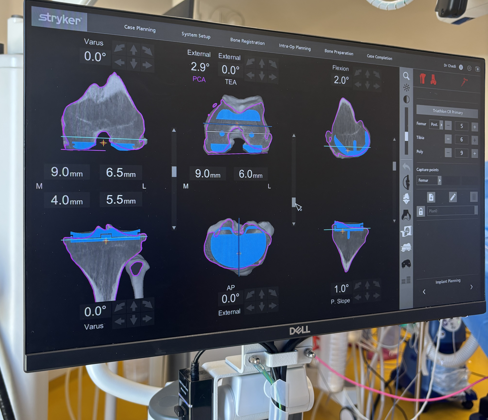

# Git-Series-00
Ce dépôt sert à apprendre les bases de Git et GitHub
## Introduction
Ce dépôt a pour objectif d'apprendre, par la pratique, les bases de Git et GitHub.
Avant ce cours, je n'avais jamais utilisé Git ni GitHub : je découvre ces outils pour la première fois dans le cadre de mon Master 2 Ingénierie des Dispositifs pour la Santé.
J'ai hâte d'en apprendre davantage sur Git et GitHub, car ces outils me seront utiles pour organiser mes projets et collaborer avec d'autres personnes.

## Une image
   

   
## Ma motivation

Dans le domaine des dispositifs médicaux, savoir analyser des données devient indispensable, et Python, R et Git sont des outils clés pour cela.
Git et GitHub m'intéressent aussi pour garder une trace de mon travail, ne plus perdre mes fichiers, et pouvoir collaborer facilement avec d'autres personnes.

Avec Python et R, je souhaite apprendre à traiter des données, faire des statistiques et créer des graphiques clairs.
Au début, l'installation m'a paru compliquée, mais voir mon premier graphique et mon premier commit s'afficher m'a vraiment motivée à continuer.

Mon objectif est de devenir autonome avec ces outils pour mes futurs projets, mon stage, et ma carrière dans l'ingénierie biomédicale.

## Une image de mon ordinateur

## Ce que j'ai appris

 J'ai compris qu'un dépôt existe à deux endroits : en ligne sur GitHub et sur mon ordinateur, grâce au clonage.
J'ai appris à créer une branche (readme) pour travailler sans modifier la branche principale (main).
À chaque modification, j'ai fait un commit avec un petit message pour expliquer ce que j'avais changé.

Ensuite, j'ai utilisé push pour envoyer mon travail sur GitHub et vérifier le résultat, ce qui m'a permis de corriger une image qui ne s'affichait pas.
J'ai aussi découvert le Markdown pour écrire des titres et ajouter des images, depuis internet ou depuis mon ordinateur.

## Conclusion
Ce travail m'a pris environ deux heures.